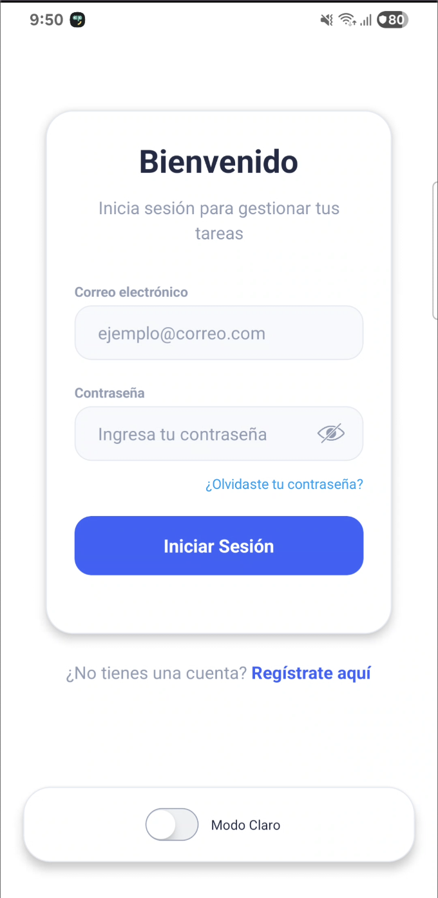
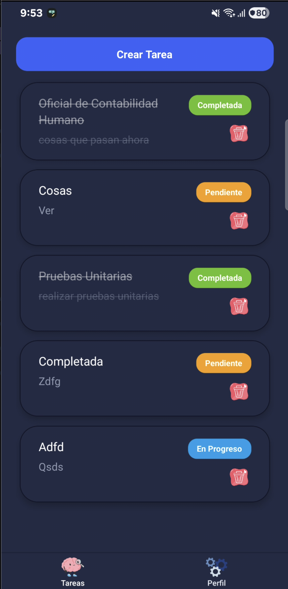
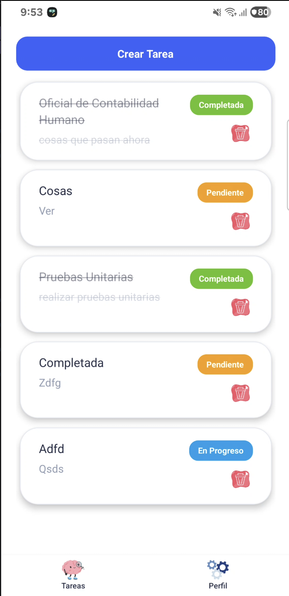
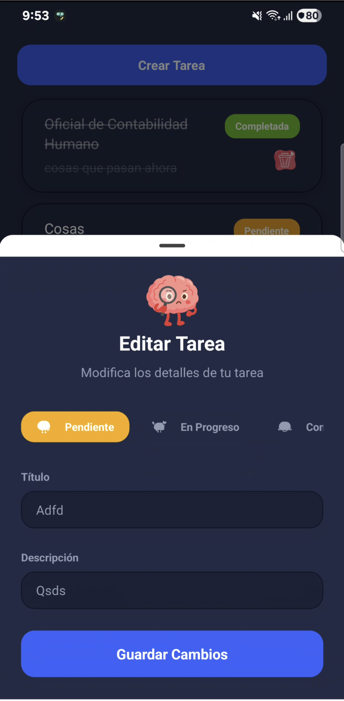

# 📸 Ejemplos Visuales de la Aplicación

Este documento contiene capturas de pantalla que muestran las principales funcionalidades de la aplicación Gestor de Tareas.

---

## 🔌 Configuración de Conexión

### Pantalla de Configuración de IP

  
  

  <em>Izquierda: Pantalla para ingresar la IP del backend | Derecha: Pantalla lista para iniciar sesión</em>

---

## 1. Autenticación

### Inicio de Sesión y Registro

  
  

  <em>Izquierda: Pantalla de inicio de sesión | Derecha: Pantalla de registro de nuevo usuario</em>

---

## 2. Visualización de Tareas

### Ver Tareas

  
  

  <em>Izquierda: Lista de tareas con filtros por estado | Derecha: Vista de tareas</em>

---

## 3. Crear y Editar Tareas

### Gestión de Tareas

  
  

  <em>Izquierda: Formulario para editar una tarea | Derecha: Formulario para crear una nueva tarea</em>

---

## 4. Perfil y Configuración

### Vista de Perfil y Configuración

  
  

  <em>Izquierda: Opciones de configuración | Derecha: Perfil de usuario</em>

---

## 🌐 Configuración Adicional

### Cambiar IP desde el Perfil

  

  <em>Opción para cambiar la IP del backend desde la pantalla de perfil</em>

---

## 📝 Notas sobre las Capturas

- Todas las capturas fueron tomadas en un dispositivo Android
- La aplicación soporta tema claro y oscuro
- La interfaz es responsive y se adapta a diferentes tamaños de pantalla
- Las imágenes muestran el flujo completo: configuración → autenticación → gestión de tareas → perfil

---

## 📱 Vista de la Aplicación por Plataforma

### iOS vs Android

  
  

  <em>Izquierda: Apariencia de la aplicación en iOS | Derecha: Apariencia de la aplicación en Android</em>

---

**Última actualización:** Febrero 2026
